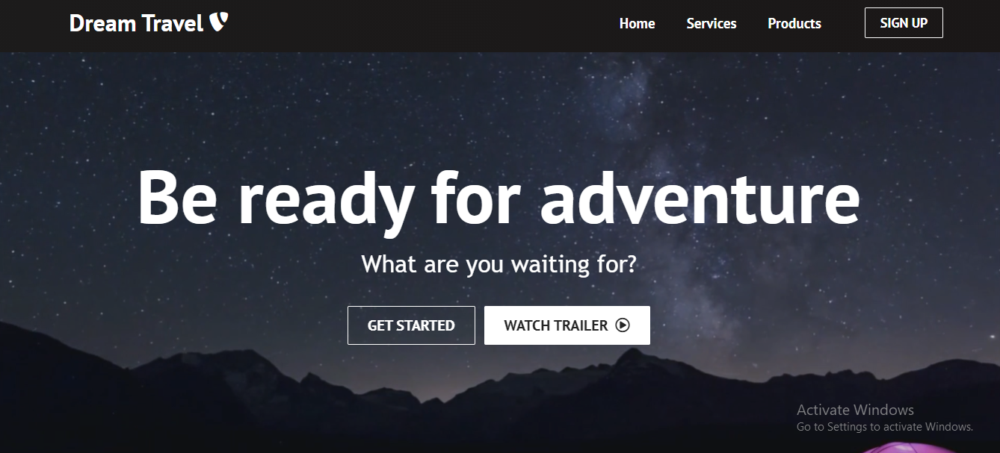

<h2 align="center">
  Dream Travel Website  
  <a href="https://dreamtra.herokuapp.com/" target="">Dream_Travel</a>
</h2>

  
 

# Built With

This project was built using below technologies.

1. React.js
2. HTML5
3. CSS3
4. VsCode
5. Heroku

# How to get started?

Install git on your machine and clone this repository.

# How to run the project?

In the terminal run npm install

In the project directory run npm start

Open http://localhost:3000 to view it in the browser. After editing the webpage will reload.

# Learn More

You can learn more in the Create React App documentation.

To learn React, check out the React documentation.

**Thank you for checking my project!!!**

### Show your support

**Give a ⭐ if you like this website!!!**
